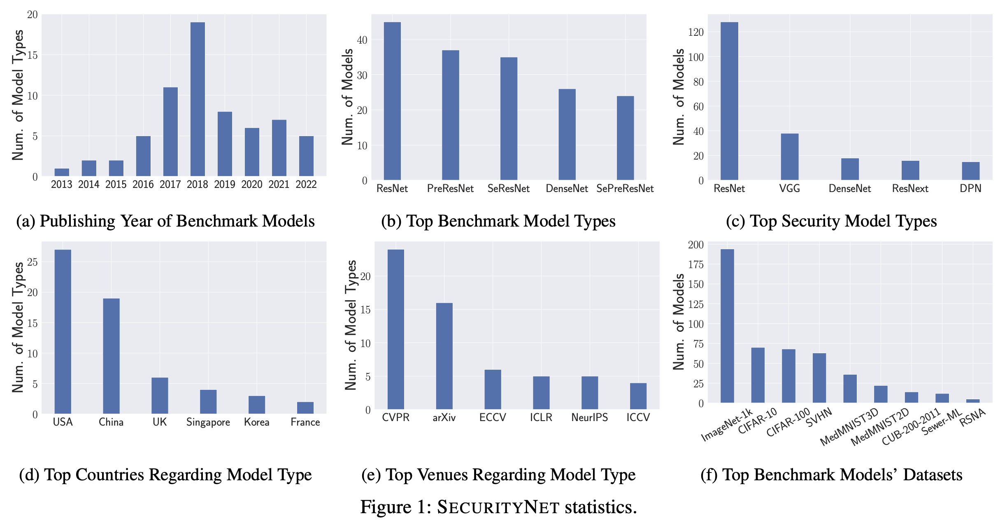

# SecurityNet

[](https://arxiv.org/pdf/2310.12665.pdf)
[](https://boz083.github.io/securitynet/)
[](https://github.com/TrustAIRLab/SecurityNet/tree/main/Database)
[](https://opensource.org/licenses/MIT)

This is the official repository for our USENIX Security Symposium 2024 paper ["SecurityNet: Assessing Machine Learning Vulnerabilities on Public Models"](https://www.usenix.org/conference/usenixsecurity24/presentation/zhang-boyang).

## Introduction  

While advanced machine learning (ML) models are deployed in numerous real-world applications, previous works demonstrate these models have security and privacy vulnerabilities.
Various empirical research has been done in this field.
However, most of the experiments are performed on target ML models trained by the security researchers themselves.
Due to the high computational resource requirement for training advanced models with complex architectures, researchers generally choose to train a few target models using relatively simple architectures on typical experiment datasets.

We argue that to understand ML models' vulnerabilities comprehensively, experiments should be performed on a large set of models trained with various purposes (not just the purpose of evaluating ML attacks and defenses).
To this end, we propose using publicly available models with weights from the Internet (public models) for evaluating attacks and defenses on ML models.
We establish a database, namely SecurityNet, containing 910 annotated image classification models.
We then analyze the effectiveness of several representative attacks/defenses, including model stealing attacks, membership inference attacks, and backdoor detection on these public models.
Our evaluation empirically shows the performance of these attacks/defenses can vary significantly on public models compared to self-trained models.
We advocate researchers to perform experiments on public models to better demonstrate their proposed methods' effectiveness in the future.



## Database

We will release all models and the corresponding annotated information in phases. Please see the [database](https://github.com/TrustAIRLab/SecurityNet/tree/main/Database) page for detailed information. 

## Citation
If you find this useful in your research, please consider citing:

```
@article{ZLYHBFZ24,
      author = {Boyang Zhang and Zheng Li and Ziqing Yang and Xinlei He and Michael Backes and Mario Fritz and Yang Zhang},
      title = {{SecurityNet: Assessing Machine Learning Vulnerabilities on Public Models}},
      journal = {{USENIX Security Symposium (USENIX Security)}},
      year = {2024}
}
```

## License
`securitynet` is licensed under the terms of the MIT license. See LICENSE for more details.
